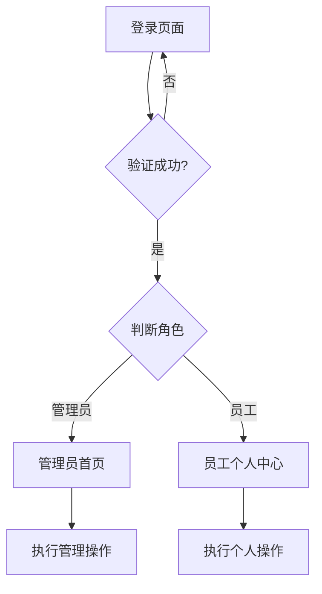

## 1. 产品概述
银行员工权限管理系统是一个面向银行内部员工的管理平台，用于实现员工档案管理、权限配置和个人信息维护。系统支持管理员和普通员工两种角色，提供安全、便捷的操作体验。

## 2. 核心功能

### 2.1 用户角色
| 角色 | 权限说明 |
|------|----------|
| 管理员 | 新建员工档案、查看/修改员工档案、修改管理员密码、岗位权限配置 |
| 普通员工 | 查看自我档案、修改自我密码 |

### 2.2 功能模块
1. **登录模块**：用户名密码验证，角色识别
2. **管理员管理模块**：员工档案CRUD、权限配置
3. **员工个人模块**：个人档案查看、密码修改

### 2.3 页面详情
| 页面名称 | 模块名称 | 功能描述 |
|-----------|-------------|-----------|
| 登录页面 | 登录表单 | 用户名密码输入、登录验证、错误提示 |
| 管理员首页 | 管理面板 | 功能菜单、快捷操作入口 |
| 员工列表 | 员工管理 | 员工信息展示、搜索筛选、操作按钮 |
| 员工详情 | 档案管理 | 查看/编辑员工完整信息 |
| 权限配置 | 岗位管理 | 岗位列表、菜单权限配置 |
| 个人中心 | 个人信息 | 查看个人档案、修改密码 |

## 3. 核心流程

用户登录 → 验证身份 → 根据角色展示对应菜单 → 执行操作 → 保存数据

## 4. 用户界面设计

### 4.1 设计风格
- **配色方案**：专业金融风格，主色调采用深蓝色系(#1e3a5f)，配合金色点缀(#c9a227)
- **按钮风格**：圆角矩形，渐变背景，悬停效果
- **字体**：思源黑体，现代简洁
- **布局风格**：卡片式设计，清晰的信息层级
- **图标**：金融行业相关图标

### 4.2 页面设计概述
| 页面名称 | 模块名称 | UI元素 |
|-----------|-------------|--------|
| 登录页面 | 登录表单 | 渐变背景、卡片式表单、品牌logo |
| 管理员首页 | 管理面板 | 侧边导航、内容区域、统计卡片 |
| 员工列表 | 员工管理 | 数据表格、搜索框、操作按钮 |
| 员工详情 | 档案管理 | 表单输入、信息展示卡片 |
| 权限配置 | 岗位管理 | 树状结构、复选框、配置表单 |

### 4.3 响应式设计
- 桌面优先设计
- 支持平板和移动端自适应

### 4.4 动效设计
- 页面切换平滑过渡
- 按钮悬停动画
- 表单验证反馈动画
- 侧边栏展开/收起动画